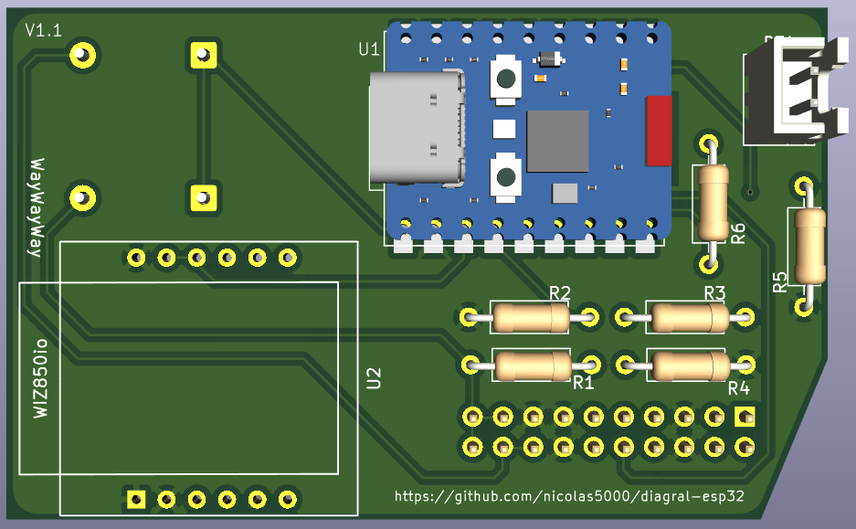
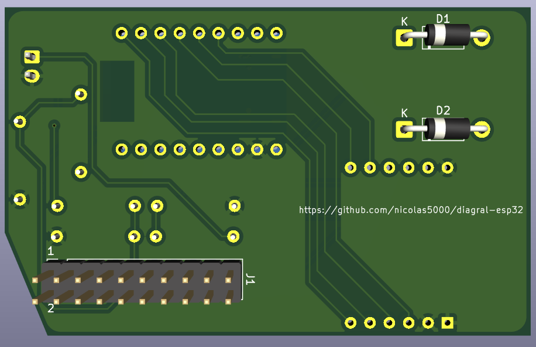
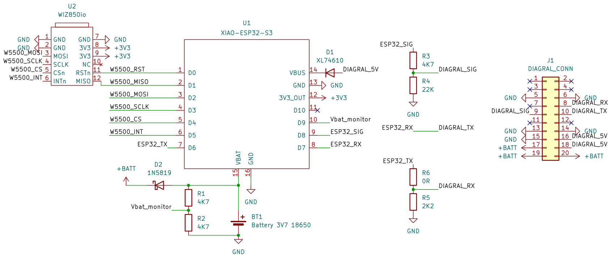
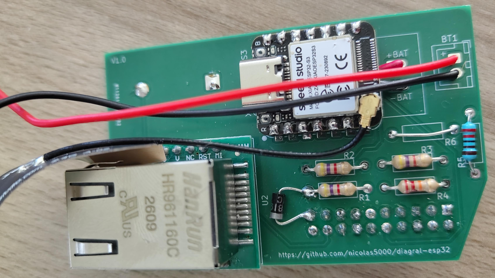
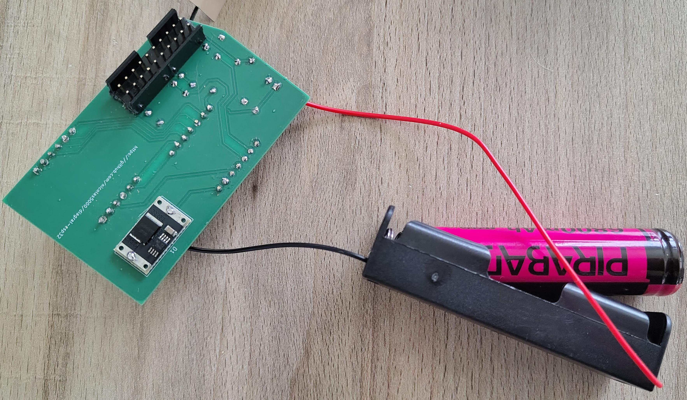
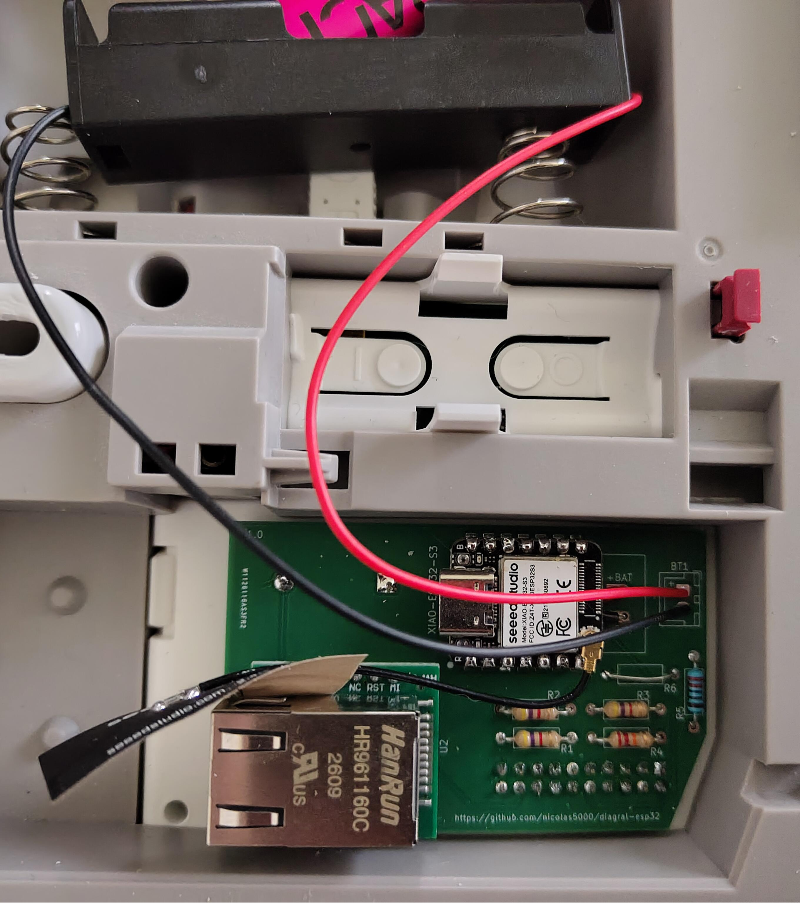

# diagral-uart-esp32
This project permits to connect to Diagral alarm system DIAG91AGFK using the 20 pins connector on the back (the connector used for the GSM board DIAG55AAX).

It permits to get status from and modify state of the alarm system as it could be done using call and SMS with official DIAG55AAX from Diagral, but using local MQTT connection... and it is directly recognized by Home Assistant!

This project is originally tested on XIAO-ESP32-S3 (with battery management by ESP32 board) and Waveshare ESP32-C6 (with battery management by the Diagral alarm system) hardware and based on ESP-IDF SDK version 6.0.2. It should also work with any other board compatible with Waveshare ESP32-S3 and ESP32-C6 board pinout.

This project is open source: you can reuse it and modify it, but please add a link to my project.
If you like this project you can [contribute](#how-to-contribute) or [buy me a coffee](https://buymeacoffee.com/nicolas5000) to support the tens of hours I spent on it :blush:.

### Why I did this project

From Diagral, DIAG55AAX (also known as DIAG55AAX1) is a 2G only mobile network board and DIAG55AAX5 is 2G/3G mobile network board. These boards will not work anymore in the future as the 2G and 3G mobile networks are being replaced by 4G and 5G networks. Of course you can buy the official Diagral 4G device to replace your old DIAG55AAX module.

The goal of this project is to connect your Diagral system locally to your Home Assistant without any Cloud based solution.

### **Disclaimer**  
> [!CAUTION]
> This tool designed for educational and testing purposes, provided "as is", without warranty of any kind. It has no link with Diagral company. Creators and contributors are not responsible for any misuse or damage caused by this tool. Keep in mind that you should have a secure MQTT and Home Assistant instances to avoid any attack on your alarm system from your domotics.

### **Security**
To use this project in a secure way, you shall:
- Put the board on the back of the DIAG91AGFK so it is protected by your alarm system tamper mechanism.
- Put a password on command line access (at least in production, when not testing anymore).
- Use a secure network (Wifi password...).
- Use a secure MQTT connection (strong password, certificate...).
- Protect your Home Assistant access.
- If you want the best:
  - Sign your firmware and enable secure boot (see ESP-IDF documentation). This risk can be mitigated by using [HTTPS server for OTA update](#ota-over-https).
  - Enable flash encryption (see ESP-IDF documentation) to protect your Wifi password, command-line password and MQTT password. This risk is mitigated by putting the ESP32 on the back of the DIAG91AGFK (protected by your alarm system tamper mechanism).

### Documentation
This documentation contains useful information about the project, especially:
- [Hardware requirements](README.md#hardware-requirements) to use the project
- [Software configuration](doc/configuration.md) (hardware pins used, network and MQTT settings, ...)
- [Using command line](doc/command_line.md) to test and configure the project
- [MQTT topics and messages](doc/mqtt.md)
- [The project development](doc/development_guide.md) (structure of the project, how the source code is organized if you want to contribute or fork...)
- [The current knowledge about the protocol and commands](doc/protocol.md) used between DIAG91AGFK and DIAG55AAX

### Support
I try to give support on my free time. If you have questions you can open a subject and ask directly in English (for everyone to understand) or in French.

### Project status

These features are currently available:
- Get state from Diagral alarm system:
  - Mode (idle, setup, test)
  - Zones 1 to 4 status (disarmed, arming, armed, armed "home", triggered)
  - Battery charging state. Note: it works only if you have a battery connected to provide power to the device!
- Control the alarm system: Arm/"Arm home"/Disarm with or withour PIN code (choose before building firmware or from command line), can't be modified from MQTT and Home Assistant.
- Events:
  - Error event: event type (tamper, main power, battery, radio link, internet link, arm cancelled reason), harware type (system, sensor, command, siren), hardware number
  - Detection event: event type, sensor type, sensor number
  - Alert event: alert type (fire, alert, silent alert, duress disarm), command number
- Control the ESP32:
  - Reboot
  - Enable/disable logging
  - Enable/disable passive mode
- Connectivity:
  - Wifi (integrated to ESP32 chip) support
  - Ethernet support (based on W5500/WIZ850io module)
  - DHCP support, with DNS provided by DHCP server
  - Static IPv4 support, including manual DNS server configuration
- (S)NTP support for time synchronization (required to have valid timestamps in MQTT messages)
- Front-end:
  - Command line features: see [dedicated page](doc/command_line.md) for more information
    - Control the alarm system
    - Reboot ESP32
    - Change Wifi configuration without reflashing firmware (configuration applied after reboot)
    - Change DHCP/IPv4 configuration without reflashing firmware (configuration applied after reboot)
    - Change MQTT configuration without reflashing firmware (configuration applied after reboot)
    - Change Diagral configuration without reflashing firmware (configuration applied after reboot)
    - Note: command line features are password protected by default, change default password in project configuration before building firmware.
  - MQTT support: see [dedicated page](doc/mqtt.md) for more information
    - Discovery message is published and compatible with Home Assistant, permitting to automatically add device to it without extra configuration.
    - In addition:
      - A button is added to reboot the ESP32 board.
      - A switch is added to enable/disable Diagral layer logging (applied after reboot)
      - A switch is added to enable/disable Diagral passive mode (applied after reboot)
- Configuration storage to flash
- [OTA firmware update](#ota-update) (update from Wifi or Ethernet using an HTTP(S) server) with rollback.

### Diagral DIAG91AGFK 20-pins connector
The DIAG91AGFK has a 20-pins connector on the back to connect the DIAG55AAX GSM module. We use this connector for our project. Please check pin numbers:

Here is the pin description for the connector:
| Pin # | Description | Used by the project? |
|----|---|---|
| 1 | Audio from DIAG91AGFK microphone, unknown format | No |
| 2 | Audio to DIAG91AGFK speaker, unknown format | No |
| 3 | Audio from DIAG91AGFK microphone, unknown format | No |
| 4 | Audio to DIAG91AGFK speaker, unknown format | No |
| 5 | GND | Yes (at least once) |
| 6 | GND | Yes (at least once) |
| 7 | Seems to be 2.8V (LVCMOS?) from DIAG91AGFK | No |
| 8 | RX for DIAG91AGFK / TX for DIAG55AAX and our project (0V at low state, 2.8V at high state) | Yes |
| 9 | "Signal" pin, low by default, set to 2.8V by DIAG91AGFK or DIAG55AAX a few ms before sending any command on corresponding TX (wake up?) | Yes |
| 10 | TX for DIAG91AGFK / RX for DIAG55AAX and our project (0V at low state, 2.8V at high state) | Yes |
| 11 | 3.3V from DIAG55AAX | No |
| 12 | Seems to be 2.8V (LVCMOS?) from DIAG91AGFK | No |
| 13 | GND | Yes (at least once) |
| 14 | GND | Yes (at least once) |
| 15 | GND | Yes (at least once) |
| 16 | Power from DIAG91AGFK | Yes (at least once) |
| 17 | +BATT from the project | Yes (at least once. If not using battery, use a 1N5819 to connect power from pin 16 or 18 to this pin) |
| 18 | Power from DIAG91AGFK | Yes (at least once) |
| 19 | +BATT from the project | Yes (at least once. If not using battery, use a 1N5819 to connect power from pin 16 or 18 to this pin) |
| 20 | +BATT from the project | Yes (at least once. If not using battery, use a 1N5819 to connect power from pin 16 or 18 to this pin) |

> [!NOTE]
> - It is not required to connect all GND pins as they are already connected together on DIAG91AGFK side. Connect your project board to at least 1 GND pin.
> - It is not required to connect all Power pins as they are already connected together on DIAG91AGFK side. Connect your project board to at least 1 power pin.
> - It is not required to connect all +BATT pins as they are already connected together on DIAG91AGFK side. Connect your project board to at least 1 +BATT pin.

### Hardware requirements

In order to use this project, you will need:
- ESP32 board:
  - For PCB "beta" and 1.0, use [Seeed Studio XIAO-ESP32-S3](https://www.amazon.fr/dp/B0BYSB66S5/).
  - For PCB 1.1, use Waveshare ESP32-C6 or ESP32-S3 (or from other provider, but with equivalent pinout).
- 5 or 6 resistors (see the schematics):
  - R1 and R2 are required only if you want to monitor battery voltage. You can choose any values but the voltage on the GPIO shall always remains under 3.3V! I chose to use the same resistors but it's not mandatory. You can modify min (0%) and max (100%) voltage values in the configuration.
  - R3 and R4 are always required as they permit to convert the voltage level between Diagral (2.8V) and ESP32 (3.3V) for "Signal" pin.
  - R5 and R6 are always required as they permit to convert the voltage level between Diagral (2.8V) and ESP32 (3.3V) for "ESP32 TX" pin. Please note that in my case R6 is not needed as the ESP32-S3 board from Seeed Studio and Waveshare already have a 499 ohm resistor internally.
- For PCB "beta" and 1.0, [XL74610](https://www.amazon.fr/dp/B0H2HY1DP9/) "ideal diode" if you plan to charge the battery from the DIAG91AGFK 5V power supply (in fact the DIAG91AGFK provides 4.5V and it is required to use at least 4.257V to fully charge a battery like 18650 that is 4.2V at 100%, so normal diode can't be used)
- 1 (PCB "beta" and 1.0) or 2 (PCB 1.1) 1N5819 diode(s).
- Wires:
  - To connect everything to the ESP32 board if you don't use a PCB.
  - To Replace R6 0 ohm resistor
  - On PCB "beta" and 1.0 only, to connect battery pins to XIAO back.
- USB cable to connect the ESP32 board to your computer for first flashing of the firmware.
- Battery (like 18650 battery, I didn't try to reuse the battery provided with the DIAG55AAX module but it could work) and its connector.
- [W5500](https://www.amazon.fr/dp/B0B775X737/) Ethernet module only if you don't want to use Wifi
- 20 pins connector to connect to DIAG91AGFK if you don't want to use "Dupont" wires on your final project board.

### PCB
I have created a [kicad](./kicad/) project for schematics and PCB routing. Current version of the PCB is 1.1.  
You can directly purchase a PCB (minimum order of 5 units) from PCBWay using this [link](https://www.pcbway.com/project/shareproject/diagral_esp32_gerber_d70e3251.html) or ask me for available PCB and passive components (I don't provide ESP32, W5500 and battery and I don't solder the components). 

> [!CAUTION]
> Please note that mounting the W5500 module to use the Ethernet link will require to cut the back of the DIAG91AGFK because the W5500 is too big as you can see:

#### PCB versions

| PCB # | ESP32 compatibility | Limitations |
|----|---|---|
| beta | [Seeed Studio XIAO-ESP32-S3](https://www.amazon.fr/dp/B0BYSB66S5/) | (1) (2) |
| 1.0 | [Seeed Studio XIAO-ESP32-S3](https://www.amazon.fr/dp/B0BYSB66S5/) | (2) |
| 1.1 | Waveshare [ESP32-C6-Zero](https://amzn.eu/d/0iYieorw) or [ESP32-S3-Zero](https://amzn.eu/d/05cgIHxE) (or equivalent pinout and footprint) | No known limitation |

Known limitations:
- (1) Ethernet module is not working on this PCB due to footprint error. Use this PCB only for Wifi project.
- (2) The 1N5819 is missing on this PCB. You have to cut the track between R1 and pin 19 of the connector and put the 1N5819 as shown on the schematics below (D2):

#### Available PCB from France

| PCB # | PCB price | Passive components (optional) | Quantity available |
|----|---|---|---|
| beta | 3€ | 2€ for 20-pin connector, 1x 1N5819, 1x XL74610, 3x 4.7k resistors, 1x 22k resistor, 1x 2.2k resistor | 3 (in stock) |
| 1.0 | 3€ | 2€ for 20-pin connector, 1x 1N5819, 1x XL74610, 3x 4.7k resistors, 1x 22k resistor, 1x 2.2k resistor | 4 (in stock) |
| 1.1 | 5€ | 1€ for 20-pin connector, 2x 1N5819, 3x 4.7k resistors, 1x 22k resistor, 1x 2.2k resistor | on demand |

Additional costs for packaging and shipping to France (bubble envelope with tracking number) : 4€

> [!NOTE]
> Not included: ESP32, W5500 Ethernet module, battery and its connector, soldering the components on the PCB.

Here is an example of components on PCB 1.0:
  

### Development environment

The development environment is based on:
- Visual Studio Code (also known as VSCode)
- ESP-IDF extension for VSCode and ESP-IDF SDK installed

### Starting guide

Here are a few steps to follow to start with this project:
1. If you are not familiar with VSCode and ESP-IDF, I encourage you to read ESP-IDF starting guide and try the "Hello world" example on your ESP32 board. You should be able to build the example, flash the binary to your ESP32 board and monitor the execution from ESP-IDF monitor tool before going to next step.
2. Download this project / clone the repository, then open the project folder in VSCode.
3. Solder the components on the PCB or use wires to connect all the pins on your prototyping board (see schematics above).
4. Copy and rename the sdkconfig.defaults_xxx file to sdkconfig.defaults depending on your hardware.
5. Choose the ESP32-S3 or ESP32-C6 target depending on your hardware.
6. Open "SDK Configuration Editor" to configure the project and go to "Diagral UART Project Configuration" section. Configure network and choose the GPIO pins you want to use to connect everything.
7. Provide your HTTPS public certificate for OTA (see [OTA section](#ota-update) to generate a certificate) or create an empty file named _ca_cert.pem_
8. Build the source code, flash it to the board and monitor (there is single button that does everything if you are confident, otherwise, use the 3 buttons in this order).

By default the project is configured with verbose enabled and not in passive mode: you can see what happens with detailed logs and you can control your Diagral alarm system. In active mode you can use the command line to send commands to your Diagral system. You can use passive mode to get frames from DIAG91AGFK to DIAG55AAX only (but you have to connect all 20 pins).

#### Passive mode

As previously explained, in passive mode (don't forget to enable verbose) you will get frames from DIAG91AGFK to DIAG55AAX only.
If you need to see all exchanges you will have to use another "spy UART project".

#### Active mode

In this mode you can control your alarm system.

> [!NOTE]
> - Keep verbose enabled if you want to see what happens in Diagral UART layer. In addition to console, exchanged frames can be sent to a Syslog server.

### OTA update
In order to update the firmware from Wifi or Ethernet securely, you should use an HTTPS server. If you don't mind, you can also use a simple HTTP server. This section describes the 2 options.

#### OTA over HTTPS
1. Generate your certificate and key: you can use the command `openssl req -x509 -newkey rsa:2048 -keyout ca_key.pem -out ca_cert.pem -days 365 -nodes`. Don't forget to use a CN field that matches the machine IP address or name (like _myserver.lan_) that will be used in the URL when performing OTA. Note: this file is required to build and be included within the first firmware to load using USB.
2. Open the update port in your firewall
3. Launch the HTTPS server. You can use the command `python3 simple_ota_https_server.py <BIN_DIR> <PORT> [CERT_DIR]` (simple_ota_https_server.py is in the tools folder)
4. From Home Assistant, enter the URL of the .bin file: `https://myserver.lan:8070/diagral-uart-esp32.bin` assuming you are using port 8070 on machine myserver.lan
5. Wait a few time (upgrade should be done in less than 30 seconds)

#### OTA over HTTP
1. Create an empty file named ca_cert.pem and disable option _Allow OTA update only over HTTPS_ in the project configuration before building the firmware
2. Open the update port in your firewall
3. Launch the HTTP server. You can use the command `python3 -m http.server 8070 --bind ::` in the build folder containing diagral-uart-esp32.bin
4. From Home Assistant, enter the URL of the .bin file: `http://myserver.lan:8070/diagral-uart-esp32.bin` assuming you are using port 8070 on machine myserver.lan
5. Wait a few time (upgrade should be done in less than 30 seconds)

### Home Assistant integration
The board will be automatically discovered by Home Assistant MQTT integration and provide controls (with control panel for all zones and for each zone), PIN code verification (if enabled in the configuration), events (detection, alert, error), diagnostics and OTA firmware update.

### How to contribute

You can mainly contribute to this project by:
- Testing this project on your DIAG91AGFK alarm system and reporting any issue.
- If you have development skills you can propose source code modification to fix issues.
- [Buy me a coffee](https://buymeacoffee.com/nicolas5000).
